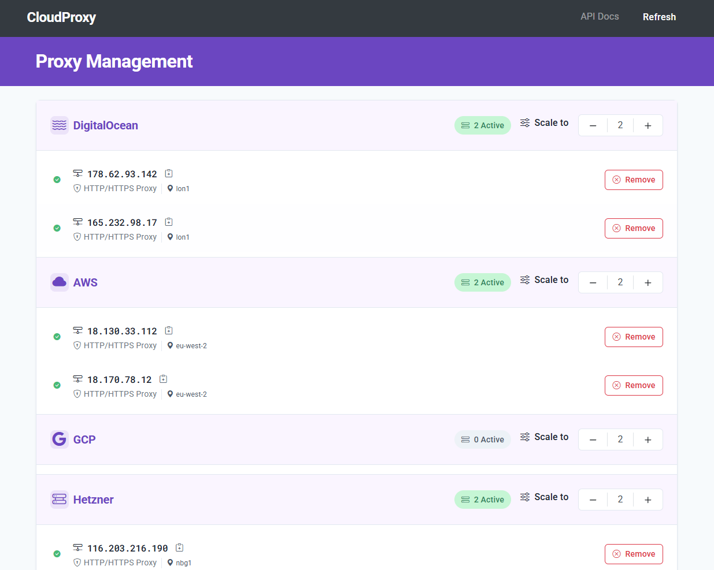

[![CodeCov Coverage][codecov-shield]][codecov-url]
[![Codacy Quality][codacy-shield]][codacy-url]
[![Docker Cloud Build Status][docker-shield]][docker-url]
[![Contributors][contributors-shield]][contributors-url]
[![Forks][forks-shield]][forks-url]
[![Stargazers][stars-shield]][stars-url]
[![Issues][issues-shield]][issues-url]
[![MIT License][license-shield]][license-url]
# CloudProxy


<!-- ABOUT THE PROJECT -->
## About The Project

The purpose of CloudProxy is to hide your scrapers IP behind the cloud. It allows you to spin up a pool of proxies using popular cloud providers with just an API token. No configuration needed. 

CloudProxy exposes an API with the IPs and credentials of the provisioned proxies. 

### Providers supported:
* [DigitalOcean](docs/digitalocean.md)
* [AWS](docs/aws.md)
* [Google Cloud](docs/gcp.md)
* [Hetzner](docs/hetzner.md)

### Planned:
* Azure
* Scaleway
* Vultr


### Inspired by
This project was inspired by [Scrapoxy](https://github.com/fabienvauchelles/scrapoxy), though that project no longer seems actively maintained. 

The primary advantage of CloudProxy over Scrapoxy is that CloudProxy only requires an API token from a cloud provider. CloudProxy automatically deploys and configures the proxy on the cloud instances without the user needing to preconfigure or copy an image.

Please always scrape nicely, respectfully and do not slam servers.

<!-- GETTING STARTED -->
## Getting Started

To get a local copy up and running follow these simple steps.

### Prerequisites

All you need is:
* Docker

### Installation

#### Environment variables:

##### Required
- `USERNAME` - set the username for the forward proxy.
- `PASSWORD` - set the password for the forward proxy.

##### Optional

`` AGE_LIMIT`` - set the age limit for your forward proxies in seconds. Once the age limit is reached, the proxy is replaced. A value of 0 disables the feature. Default value: 0.

See individual provider pages for environment variables required in above providers supported section.

#### Docker (recommended)

For example:

   ```shell
   docker run -e USERNAME='CHANGE_THIS_USERNAME' \
       -e PASSWORD='CHANGE_THIS_PASSWORD' \
       -e DIGITALOCEAN_ENABLED=True \
       -e DIGITALOCEAN_ACCESS_TOKEN='YOUR SECRET ACCESS KEY' \
       -it -p 8000:8000 laffin/cloudproxy:latest
   ```

It is recommended to use a Docker image tagged to a version e.g. `laffin/cloudproxy:0.6.0-beta`, see [releases](https://github.com/claffin/cloudproxy/releases) for latest version.

<!-- USAGE EXAMPLES -->
## Usage
CloudProxy exposes an API on localhost:8000. Your application can use the below API to retrieve the IPs with auth for the proxy servers deployed. Then your application can use those IPs to proxy. 

The logic to cycle through IPs for proxying will need to be in your application, for example:

```python
import random
import requests as requests


# Returns a random proxy from CloudProxy
def random_proxy():
    ips = requests.get("http://localhost:8000").json()
    return random.choice(ips['ips'])


proxies = {"http": random_proxy(), "https": random_proxy()}
my_request = requests.get("https://api.ipify.org", proxies=proxies)
```
### CloudProxy UI



You can manage CloudProxy via an API and UI. You can access the UI at `http://localhost:8000/ui`.

You can scale up and down your proxies and remove them for each provider via the UI. 

## CloudProxy API
### List available proxy servers
#### Request

`GET /`

    curl -X 'GET' 'http://localhost:8000/' -H 'accept: application/json'

#### Response

    {"ips":["http://username:password:192.168.0.1:8899", "http://username:password:192.168.0.2:8899"]}

### List random proxy server
#### Request

`GET /random`

    curl -X 'GET' 'http://localhost:8000/random' -H 'accept: application/json'

#### Response

    ["http://username:password:192.168.0.1:8899"]

### Remove proxy server
#### Request

`DELETE /destroy`

    curl -X 'DELETE' 'http://localhost:8000/destroy?ip_address=192.1.1.1' -H 'accept: application/json'

#### Response

    ["Proxy <{IP}> to be destroyed"]

### Restart proxy server (AWS & GCP only)
#### Request

`DELETE /restart`

    curl -X 'DELETE' 'http://localhost:8000/restart?ip_address=192.1.1.1' -H 'accept: application/json'

#### Restart

    [""Proxy <{IP}> to be restarted"]

### Get providers
#### Request

`GET /providers`

    curl -X 'GET' 'http://localhost:8000/providers' -H 'accept: application/json'

#### Response

```json
{
  "digitalocean": {
    "enabled": "True",
    "ips": [
      "x.x.x.x"
    ],
    "scaling": {
      "min_scaling": 1,
      "max_scaling": 2
    },
    "size": "s-1vcpu-1gb",
    "region": "lon1"
  },
  "aws": {
    "enabled": false,
    "ips": [],
    "scaling": {
      "min_scaling": 2,
      "max_scaling": 2
    },
    "size": "t2.micro",
    "region": "eu-west-2",
    "ami": "ami-096cb92bb3580c759",
    "spot": false
  },
  "gcp": {
    "enabled": false,
    "project": null,
    "ips": [],
    "scaling": {
      "min_scaling": 2,
      "max_scaling": 2
    },
    "size": "f1-micro",
    "zone": "us-central1-a",
    "image_project": "ubuntu-os-cloud",
    "image_family": "ubuntu-minimal-2004-lts"
  },
  "hetzner": {
    "enabled": false,
    "ips": [],
    "scaling": {
      "min_scaling": 2,
      "max_scaling": 2
    },
    "size": "cx11",
    "location": "nbg1",
    "datacenter": ""
  }
}
```

#### Request

`GET /providers/digitalocean`

    curl -X 'GET' 'http://localhost:8000/providers/digitalocean' -H 'accept: application/json'

#### Response

```json
{
  "enabled": "True",
  "ips": [
    "x.x.x.x"
  ],
  "scaling": {
    "min_scaling": 2,
    "max_scaling": 2
  },
  "size": "s-1vcpu-1gb",
  "region": "lon1"
}
```

### Update provider
#### Request

`PATCH /providers/digitalocean`

    curl -X 'PATCH' 'http://localhost:8000/providers/digitalocean?min_scaling=5&max_scaling=5' -H 'accept: application/json'

#### Response

      {
        "ips": [
          "192.1.1.2",
          "192.1.1.3"
        ],
        "scaling": {
          "min_scaling": 5,
          "max_scaling": 5
        }
      }

CloudProxy runs on a schedule of every 30 seconds, it will check if the minimum scaling has been met, if not then it will deploy the required number of proxies. The new proxy info will appear in IPs once they are deployed and ready to be used.

<!-- ROADMAP -->
## Roadmap

The project is at early alpha with limited features. In the future more providers will be supported, autoscaling will be implemented and a rich API to allow for blacklisting and recycling of proxies.

See the [open issues](https://github.com/claffin/cloudproxy/issues) for a list of proposed features (and known issues).

## Limitations
This method of scraping via cloud providers has limitations, many websites have anti-bot protections and blacklists in place which can limit the effectiveness of CloudProxy. Many websites block datacenter IPs and IPs may be tarnished already due to IP recycling. Rotating the CloudProxy proxies regularly may improve results. The best solution for scraping is via proxy services providing residential IPs, which are less likely to be blocked, however are much more expensive. CloudProxy is a much cheaper alternative for scraping sites that do not block datacenter IPs nor have advanced anti-bot protection. This a point frequently made when people share this project which is why I am including this in the README. 

<!-- CONTRIBUTING -->
## Contributing

Contributions are what make the open source community such an amazing place to be learn, inspire, and create. Any contributions you make are **greatly appreciated**.

1. Fork the Project
2. Create your Feature Branch (`git checkout -b feature/AmazingFeature`)
3. Commit your Changes (`git commit -m 'Add some AmazingFeature'`)
4. Push to the Branch (`git push origin feature/AmazingFeature`)
5. Open a Pull Request


<!-- LICENSE -->
## License

Distributed under the MIT License. See `LICENSE` for more information.


<!-- CONTACT -->
## Contact

Your Name - [@christianlaffin](https://twitter.com/christianlaffin) - christian.laffin@gmail.com

Project Link: [https://github.com/claffin/cloudproxy](https://github.com/claffin/cloudproxy)


<!-- ACKNOWLEDGEMENTS -->
## Acknowledgements

* []()
* []()
* []()


<!-- MARKDOWN LINKS & IMAGES -->
<!-- https://www.markdownguide.org/basic-syntax/#reference-style-links -->
[contributors-shield]: https://img.shields.io/github/contributors/claffin/cloudproxy.svg?style=flat-square
[contributors-url]: https://github.com/claffin/cloudproxy/graphs/contributors
[forks-shield]: https://img.shields.io/github/forks/claffin/cloudproxy.svg?style=flat-square
[forks-url]: https://github.com/claffin/cloudproxy/network/members
[stars-shield]: https://img.shields.io/github/stars/claffin/cloudproxy.svg?style=flat-square
[stars-url]: https://github.com/claffin/cloudproxy/stargazers
[issues-shield]: https://img.shields.io/github/issues/claffin/cloudproxy.svg?style=flat-square
[issues-url]: https://github.com/claffin/cloudproxy/issues
[license-shield]: https://img.shields.io/github/license/claffin/cloudproxy.svg?style=flat-square
[license-url]: https://github.com/claffin/cloudproxy/blob/master/LICENSE.txt
[docker-url]: https://hub.docker.com/r/laffin/cloudproxy
[docker-shield]: https://img.shields.io/github/workflow/status/claffin/cloudproxy/CI?style=flat-square
[codecov-url]: https://app.codecov.io/gh/claffin/cloudproxy
[codecov-shield]: https://img.shields.io/codecov/c/github/claffin/cloudproxy?style=flat-square
[codacy-shield]: https://img.shields.io/codacy/grade/39a9788caa854baebe01beb720e9c5a8?style=flat-square
[codacy-url]: https://www.codacy.com/gh/claffin/cloudproxy/dashboard?utm_source=github.com&amp;utm_medium=referral&amp;utm_content=claffin/cloudproxy&amp;utm_campaign=Badge_Grade
